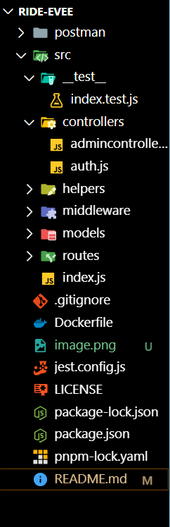
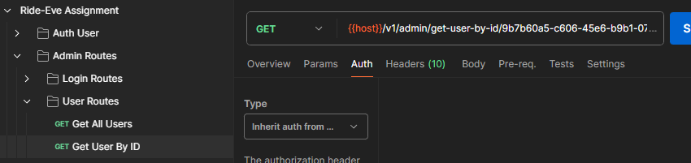
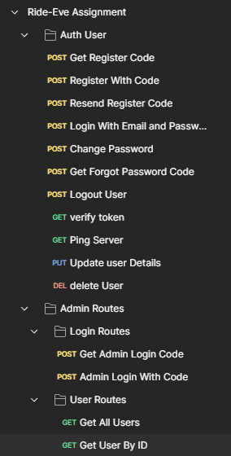

## Note 
For ENV file contact me 9167310023
---

# Authentication System Project

## Project Structure




The project is organized into various folders, each serving a specific function in the authentication system. The structure can be visualized in the provided image.

## Getting Started
    // "start": "nodemon src/index.js",


To run the project, execute the following command:

```bash
npm start
```

This command will start the project.

## Environment Setup

### Steps to Clone and Install Dependencies

1. Clone the repository to your local machine.
2. Run `npm install` to install all the necessary npm packages.

### API Testing with Postman

Set up your Postman environment by importing the provided Postman collection. To test the authentication API:



1. Start the server with `npm start`.
2. Navigate to the 'Authentication' section in Postman.
3. Select 'Auth User'.
4. In the 'Body' tab, enter the required details to perform the authentication.

## Modules



The project includes the following modules:

- **Nodemailer**: Used for sending emails. Ensure you enter a valid email ID to receive the OTP.
- **Authentication Routes**:
  - Get register code
  - Register with code
  - Resend register code
  - Login with email and password (POST request)
  - Change password (POST request)

## Admin Routes

Admin routes allow for administrative actions:

- Get user details
- Get user details by ID
- Login with code
- Register with code

**Note**: To log in as an admin, use the specific email ID `admin@razzaq.com`. For the OTP, please contact the project maintainer or refer to the Postman collection.

## User Management

- **Delete User**: This functionality is included in the auth user controller.

## Middleware

The project utilizes several middleware functions to handle various tasks within the authentication process.

---